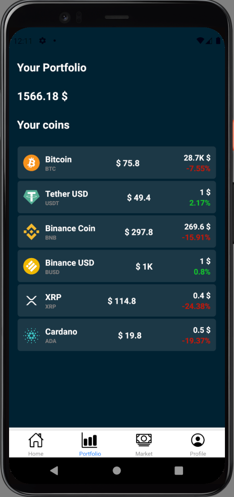

<div id="top"></div>

<!-- PROJECT LOGO -->
<br />
<div align="center">
  <a href="images/logo.png">
    
  </a>

  <h3 align="center">KryptoApp - ohjelmistoprojekti 2 työ</h3>

  <p align="center">
     Voit sijoittaa* kryptokolikkoihin ja seurata oman portfolion todennäköistä laskua tämän sovelluksen kautta.
    <br />
    *ei oikeaa valuttaa käytössä
  </p>

  <a href="images/Screenshot.png">
    
  </a>
</div>


<!-- ABOUT THE PROJECT -->
## Projektista

<h3> KryptoApp </h3>

Meidän työmme on osittain kryptomarkkinoiden kiinnostuksen takia ja osittain pakonedessä tehty puhelinsovellus.

Emme ole kaikista ylpeimpiä tästä suorituksesta, mutta yritimme sentään jotain.

<p align="right">(<a href="#top">back to top</a>)</p>


### Käyttämämme teknologiat

* [React-native](https://reactnative.dev/)
* [Firestore/Firebase](https://firebase.google.com/)

<p align="right">(<a href="#top">back to top</a>)</p>


<!-- GETTING STARTED -->
## Alkuun pääseminen

Näin saat oman sovelluksen toimimaan.

### Edellytykset

Näitä tarvitset sovelluksen kehittämiseen
* npm
  ```sh
  npm install npm@latest -g
  ```

### Asennus

1. Get API Key at [https://rapidapi.com/Coinranking/api/coinranking1](https://rapidapi.com/Coinranking/api/coinranking1)
2. Set up firebase project [https://firebase.google.com/](https://firebase.google.com/)
2. Clone the repo
   ```sh
   git clone https://github.com/OPcryptoApp/CoinApp.git
   ```
3. Install NPM packages
   ```sh
   npm install
   ```
4. Enter your API in `.env`
   ```js
   COIN_API='ENTER YOUR Coinranking API';
   FB_KEY='ENTER YOUR FIRABASE apiKey
   ```
5. Enter your firebaseConfig in `firebase.js`

<p align="right">(<a href="#top">back to top</a>)</p>


<!-- USAGE EXAMPLES -->
## Käyttö

Voit käyttää ohjelmaa simppeliin ja eleganttiin kryptovaluuttojen seuraamiseen.

<p align="right">(<a href="#top">back to top</a>)</p>


<!-- LICENSE -->
## License

Distributed under the MIT License. See `LICENSE.txt` for more information.

<p align="right">(<a href="#top">back to top</a>)</p>


<!-- ACKNOWLEDGMENTS -->
## Acknowledgments

* [GitHub](https://github.com)

<p align="right">(<a href="#top">back to top</a>)</p>

